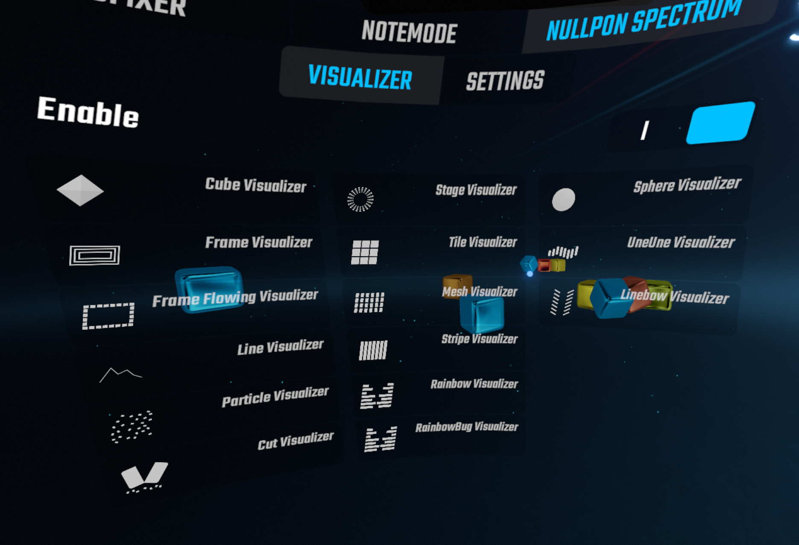
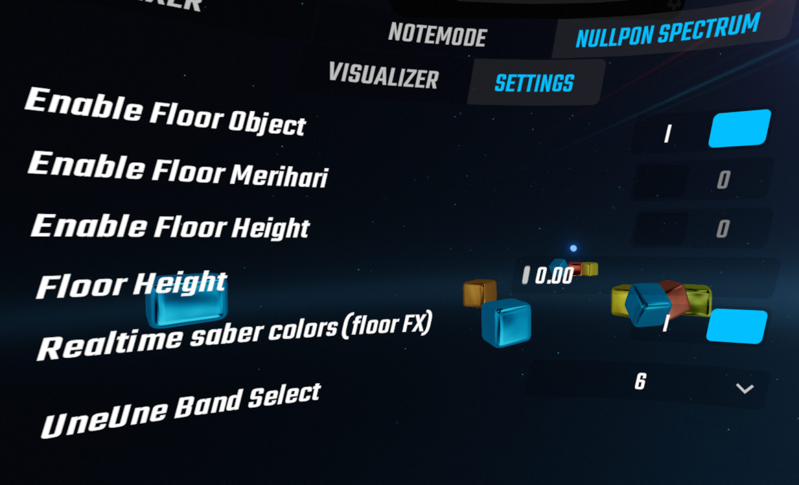

# NullponSpectrum

対応BeatSaberバージョン：　v0.1.0：1.40.0～1.42.2

プレイエリアに、音に合わせて動くオブジェクトを追加します。  
VMCAvatarとNalulunaAvatarsの床調整に対応しました。  
CustomPlatforms用に床オブジェクトの高さを調整できる設定を追加しました。

## 依存Mod

- SiraUtil
- BeatSaberMarkupLanguage

### ビジュアライザー選択タブ画面

下記画像のところのEnableをオンにして、付けたいオブジェクトを選択する  

### 設定タブ画面

下記のビジュアライザーのみ「Realtime saber colors (floor FX)」をオンにすると、Chromaなどでノーツカラーが変化したときに斬ったセイバーカラーが変更された際に、パーティクルにも正しく色が反映されます。
- Particle Visualizer
- Cut Visualizer
- Stage Visualizer

## ビジュアルパターン

- Cube Visualizer
- Frame Visualizer
- FrameFlowing Visualizer
- Line Visualizer
- Particle Visualizer
- Cut Visualizer
- Stage Visualizer
- Tile Visualizer
- Mesh Visualizer
- Stripe Visualizer
- Rainbow Visualizer
- RainbowBug Visualizer
- Sphere Visualizer
- UneUne Visualizer
- Linebow Visualizer
